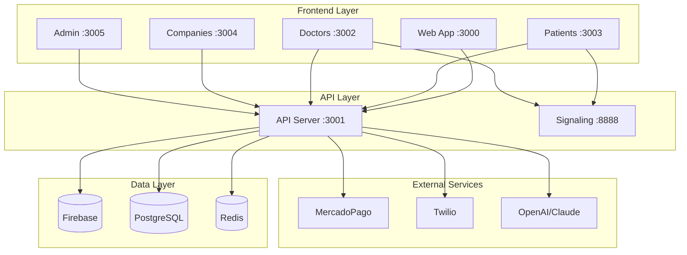
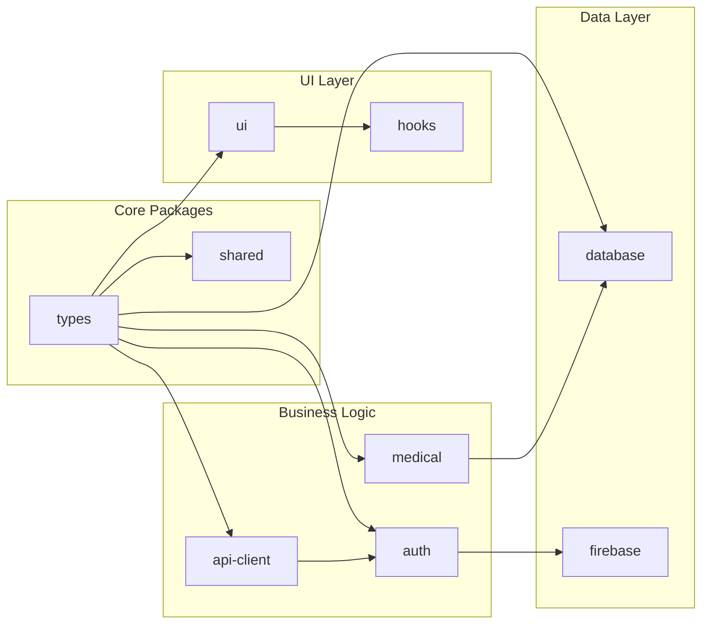
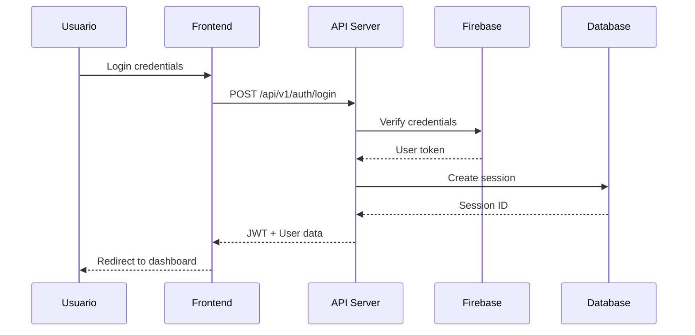

# 🏥 ARQUITECTURA TÉCNICA - PLATAFORMA ALTAMEDICA

## 📋 ÍNDICE
1. [Visión General](#visión-general)
2. [Arquitectura del Sistema](#arquitectura-del-sistema)
3. [Estructura del Monorepo](#estructura-del-monorepo)
4. [Aplicaciones](#aplicaciones)
5. [Packages Compartidos](#packages-compartidos)
6. [Stack Tecnológico](#stack-tecnológico)
7. [Flujo de Datos](#flujo-de-datos)
8. [Problemas Detectados](#problemas-detectados)
9. [Plan de Mejoras](#plan-de-mejoras)

---

## 🎯 VISIÓN GENERAL

AltaMedica es una plataforma integral de telemedicina construida como un monorepo con arquitectura de microservicios frontend, diseñada para escalar y servir a múltiples tipos de usuarios en el ecosistema de salud digital.

### Características Principales
- **Telemedicina en tiempo real** con WebRTC
- **Portal multi-tenant** para pacientes, doctores, empresas y administradores
- **Cumplimiento HIPAA** y manejo seguro de PHI
- **Sistema de pagos integrado** con MercadoPago
- **IA médica** para análisis predictivo

---

## 🏗️ ARQUITECTURA DEL SISTEMA



---

## 📁 ESTRUCTURA DEL MONOREPO

```
altamedica/
├── apps/                      # Aplicaciones frontend y backend
│   ├── web-app/              # Gateway principal (Next.js)
│   ├── api-server/           # Backend centralizado (Next.js API)
│   ├── doctors/              # Portal médicos (Next.js)
│   ├── patients/             # Portal pacientes (Next.js + PWA)
│   ├── companies/            # Portal empresas (Next.js)
│   ├── admin/                # Panel administración (Next.js)
│   └── signaling-server/     # WebRTC signaling (Express)
│
├── packages/                  # Código compartido
│   ├── @altamedica/
│   │   ├── ui/              # Componentes React + Design System
│   │   ├── auth/            # Autenticación centralizada
│   │   ├── types/           # TypeScript types
│   │   ├── hooks/           # React hooks compartidos
│   │   ├── medical/         # Utilidades médicas
│   │   ├── api-client/      # Cliente API unificado
│   │   ├── database/        # Acceso a datos
│   │   └── shared/          # Utilidades comunes
│   │
│   ├── eslint-config/        # Configuración ESLint
│   └── tailwind-config/      # Configuración Tailwind
│
├── docker/                    # Configuración Docker
├── scripts/                   # Scripts de automatización
├── docs/                      # Documentación
│
├── package.json              # Configuración root
├── pnpm-workspace.yaml       # Configuración workspaces
├── turbo.json                # Pipeline Turbo
├── docker-compose.yml        # Orquestación servicios
└── tsconfig.json             # TypeScript base config
```

---

## 🚀 APLICACIONES

### 1. **Web App** (Puerto 3000)
**Propósito**: Gateway principal y landing page
```typescript
// Stack
- Next.js 15.3.4 con App Router
- React 19.0.0
- TailwindCSS + Radix UI
- Three.js para visualizaciones 3D

// Características
- SSR/SSG optimizado
- Autenticación centralizada
- Enrutamiento inteligente por rol
- Analytics integrado
```

### 2. **API Server** (Puerto 3001)
**Propósito**: Backend centralizado y API Gateway
```typescript
// Stack
- Next.js API Routes + Express middleware
- Firebase Admin SDK
- Prisma ORM
- JWT + Session management

// Endpoints principales
/api/v1/auth/*        // Autenticación
/api/v1/patients/*    // Gestión pacientes
/api/v1/doctors/*     // Gestión médicos
/api/v1/appointments/* // Citas médicas
/api/v1/telemedicine/* // Sesiones video
/api/v1/payments/*    // Procesamiento pagos
```

### 3. **Doctors Portal** (Puerto 3002)
**Propósito**: Interfaz especializada para médicos
```typescript
// Características
- Dashboard analítico avanzado
- Herramientas de diagnóstico
- Videollamadas WebRTC HD
- Prescripción electrónica
- Calendario inteligente
- Marketplace de oportunidades laborales
```

### 4. **Patients Portal** (Puerto 3003)
**Propósito**: Portal personalizado para pacientes
```typescript
// Características
- PWA con soporte offline
- Historial médico completo
- Booking de citas online
- Telemedicina simplificada
- Seguimiento de tratamientos
- Notificaciones push
```

### 5. **Companies Portal** (Puerto 3004)
**Propósito**: Dashboard B2B para empresas
```typescript
// Características
- Gestión de empleados
- Analytics de salud corporativa
- Contratación de servicios médicos
- Facturación empresarial
- Reportes personalizados
```

### 6. **Admin Panel** (Puerto 3005)
**Propósito**: Panel de administración del sistema
```typescript
// Características
- Monitoreo en tiempo real
- Gestión de usuarios y roles
- Analytics y métricas KPI
- Configuración del sistema
- Logs y auditoría
```

### 7. **Signaling Server** (Puerto 8888)
**Propósito**: Servidor WebRTC para videollamadas
```typescript
// Stack
- Express + Socket.io
- Redis para sesiones
- STUN/TURN integration

// Características
- Señalización WebRTC
- Gestión de salas
- Control de calidad
- Recording capabilities
```

---

## 📦 PACKAGES COMPARTIDOS

### Arquitectura de Packages



### Descripción de Packages

#### **@altamedica/ui**
Sistema de diseño corporativo con componentes médicos especializados
```typescript
// Exportaciones principales
export { Button, Card, Input, Badge } from './components';
export { AppointmentCard, HealthMetricCard } from './medical';
export { DashboardLayout, MetricsGrid } from './layouts';
export { useTheme, useMediaQuery } from './hooks';
```

#### **@altamedica/auth**
Autenticación SSO centralizada con Firebase
```typescript
// Características
- Login/Register unificado
- JWT management
- Role-based access control (RBAC)
- Session persistence
- OAuth providers
```

#### **@altamedica/types**
Tipos TypeScript centralizados con validación Zod
```typescript
// Schemas principales
- User, Patient, Doctor, Company
- Appointment, Prescription, MedicalRecord
- Payment, Invoice, Transaction
- WebRTC Session, Chat Message
```

#### **@altamedica/medical**
Utilidades y validaciones médicas especializadas
```typescript
// Funcionalidades
- Validación CIE-10/CIE-11
- Cálculo de dosis
- Interacciones medicamentosas
- Protocolos FHIR
- HL7 messaging
```

---

## 💻 STACK TECNOLÓGICO

### Frontend
| Tecnología | Versión | Uso |
|------------|---------|-----|
| **Next.js** | 15.3.4 | Framework principal |
| **React** | 19.0.0 | UI Library |
| **TypeScript** | 5.0+ | Type safety |
| **TailwindCSS** | 3.4+ | Styling |
| **Radix UI** | Latest | Componentes accesibles |
| **TanStack Query** | v5 | State management |
| **Zustand** | 4.5+ | Global state |
| **React Hook Form** | 7.5+ | Forms |
| **Zod** | 3.22+ | Validation |

### Backend
| Tecnología | Versión | Uso |
|------------|---------|-----|
| **Node.js** | 18+ LTS | Runtime |
| **Express** | 4.19+ | Server framework |
| **Firebase** | 10+ | Auth + Firestore |
| **PostgreSQL** | 15 | Base de datos principal |
| **Redis** | 7 | Cache + Sessions |
| **Prisma** | 5.18+ | ORM |
| **Socket.io** | 4.7+ | WebSockets |

### DevOps & Tools
| Tecnología | Versión | Uso |
|------------|---------|-----|
| **Docker** | Latest | Containerización |
| **PNPM** | 8.15.6+ | Package manager |
| **Turbo** | 1.13.4 | Build system |
| **ESLint** | 9+ | Linting |
| **Prettier** | 3+ | Code formatting |
| **Vitest** | Latest | Unit testing |
| **Playwright** | Latest | E2E testing |

---

## 🔄 FLUJO DE DATOS

### Flujo de Autenticación


### Flujo de Telemedicina
```mermaid
sequenceDiagram
    participant P as Patient
    participant D as Doctor
    participant S as Signaling Server
    participant A as API Server
    
    P->>A: Request consultation
    A->>D: Notify doctor
    D->>A: Accept consultation
    A->>S: Create room
    S-->>P: Room credentials
    S-->>D: Room credentials
    P->>S: Join room
    D->>S: Join room
    S-->>P: ICE candidates
    S-->>D: ICE candidates
    P<->D: P2P WebRTC connection
```

---

## ⚠️ PROBLEMAS DETECTADOS

### 🔴 Críticos (Impacto Alto)

1. **Versiones de React Inconsistentes**
   - Algunas apps usan React 18.3.1, otras 19.0.0
   - Types no coinciden con versiones runtime

2. **Importaciones de Packages Rotas**
   - `@altamedica/ui` no exporta correctamente componentes
   - Paths de TypeScript mal configurados

3. **Build Pipeline Ineficiente**
   - Turbo cache no optimizado
   - Rebuilds innecesarios en desarrollo

### 🟡 Moderados (Impacto Medio)

4. **Código Duplicado**
   - 73 archivos con TODO/FIXME
   - Componentes repetidos entre apps
   - Lógica de negocio duplicada

5. **Configuración Fragmentada**
   - 5+ tsconfig.json diferentes
   - ESLint rules inconsistentes
   - Variables de entorno dispersas

### 🟢 Menores (Impacto Bajo)

6. **Documentación Desactualizada**
   - READMEs incompletos
   - Falta API documentation
   - Guías de setup obsoletas

---

## 📈 PLAN DE MEJORAS

### Fase 1: Estabilización (Semana 1-2)
```bash
# 1. Estandarizar versiones
pnpm update react@19.0.0 --recursive
pnpm update @types/react@19.0.0 --recursive

# 2. Fix module resolution
# Actualizar tsconfig.json base con paths correctos

# 3. Configurar barrel exports
# Crear index.ts en cada package con exports

# 4. Optimizar Turbo pipeline
# Actualizar turbo.json con cache strategy
```

### Fase 2: Consolidación (Semana 3-4)
```typescript
// 1. Unificar packages relacionados
@altamedica/core = types + shared + utils
@altamedica/ui-kit = ui + design-system
@altamedica/medical-suite = medical + hooks + components

// 2. Implementar proper DI
// 3. Setup module federation
// 4. Crear shared test utilities
```

### Fase 3: Optimización (Semana 5-6)
- Implementar lazy loading estratégico
- Optimizar bundle sizes con tree shaking
- Setup CDN para assets estáticos
- Implementar service workers
- Performance monitoring con Lighthouse CI

### Fase 4: Escalabilidad (Semana 7-8)
- Migración a microservicios backend
- Implementar GraphQL Federation
- Setup Kubernetes para orquestación
- Implementar observabilidad completa
- DR strategy y backups automatizados

---

## 🎯 MÉTRICAS DE ÉXITO

### Performance
- **Build time**: < 2 minutos (actualmente ~5 min)
- **Bundle size**: < 1MB per app (actualmente ~2MB)
- **Lighthouse score**: > 95 (actualmente ~85)
- **First Paint**: < 1s (actualmente ~2s)

### Developer Experience
- **Hot reload**: < 500ms (actualmente ~2s)
- **Type checking**: < 10s (actualmente ~30s)
- **Test execution**: < 1 min (actualmente ~3 min)
- **Setup time**: < 10 min (actualmente ~30 min)

### Business Metrics
- **Uptime**: 99.9% SLA
- **Response time**: < 200ms p95
- **Concurrent users**: 10,000+
- **Video quality**: 1080p @ 30fps

---

## 📞 CONTACTO Y SOPORTE

**Equipo de Desarrollo AltaMedica**
- Lead Developer: Eduardo Marques
- Email: dev@altamedica.com
- Slack: #altamedica-dev

---

*Última actualización: Febrero 2025*
*Versión del documento: 2.0.0*