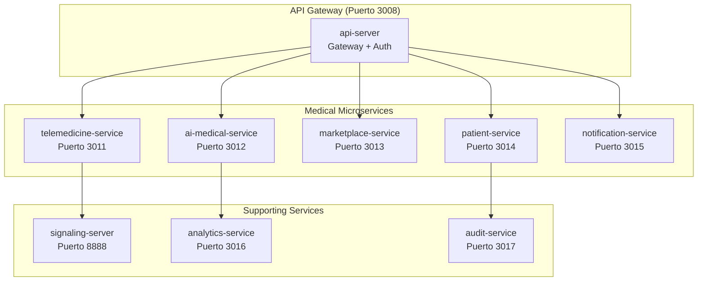

# 🏥 Plan de Evolución a Microservices Médicos - AltaMedica Platform

## 🔍 Análisis de Arquitectura Actual

### Estado Confirmado de api-server (Puerto 3008)
```
api-server/src/
├── domains/ ⭐ YA PARCIALMENTE MODULAR
│   ├── auth/ (SSO centralizado)
│   ├── telemedicine/ (WebRTC + sessions)
│   ├── marketplace/ (B2B médico)
│   ├── patients/ (gestión pacientes)
│   └── ai/ (IA médica)
├── services/ (50+ servicios)
└── lib/middleware/UnifiedAuth.ts ⭐ AUTH CENTRALIZADO
```

**DIAGNÓSTICO**: Ya tiene base modular, pero falta separación física por dominios.

## 🚀 EVOLUCIÓN PROPUESTA: Microservices Médicos Especializados

### Arquitectura Objetivo Post-Grok



### 🔧 FASE 1: Extraer Telemedicine Service

#### Estructura Propuesta
```
apps/
├── api-server/ (Gateway + Auth)
└── telemedicine-service/ ⭐ NUEVO MICROSERVICIO
    ├── package.json
    ├── src/
    │   ├── controllers/
    │   │   ├── session.controller.ts
    │   │   ├── webrtc.controller.ts
    │   │   └── recording.controller.ts
    │   ├── services/
    │   │   ├── mediasoup.service.ts
    │   │   ├── session-manager.service.ts
    │   │   └── quality-monitor.service.ts
    │   ├── lib/
    │   │   ├── webrtc-optimizations.ts
    │   │   ├── hipaa-recording.ts
    │   │   └── bandwidth-adapter.ts
    │   └── middleware/
    │       ├── session-auth.ts
    │       └── quality-gate.ts
    └── docker/
        ├── Dockerfile
        └── docker-compose.yml
```

#### Configuración Microservicio

```typescript
// apps/telemedicine-service/src/server.ts
import express from 'express';
import { createServer } from 'http';
import { Server } from 'socket.io';
import { setupMediasoup } from './lib/mediasoup-server';

class TelemedicineService {
  private app = express();
  private server = createServer(this.app);
  private io = new Server(this.server);

  async start() {
    // Setup specialized telemedicine routes
    this.app.use('/api/v1/sessions', sessionRoutes);
    this.app.use('/api/v1/webrtc', webrtcRoutes);
    this.app.use('/api/v1/quality', qualityRoutes);

    // Initialize MediaSoup for WebRTC
    await setupMediasoup();

    // HIPAA compliant session recording
    this.setupHIPAARecording();

    this.server.listen(3011, () => {
      console.log('🏥 Telemedicine Service running on port 3011');
    });
  }

  private setupHIPAARecording() {
    // Implementar grabación encriptada AES-256-GCM
    // Audit logs automáticos
    // Retention policies
  }
}
```

### 🔧 FASE 2: Extraer AI Medical Service

```
apps/ai-medical-service/
├── src/
│   ├── controllers/
│   │   ├── diagnosis.controller.ts
│   │   ├── symptoms.controller.ts
│   │   └── drug-interactions.controller.ts
│   ├── ai-models/
│   │   ├── symptom-analyzer.tflite
│   │   ├── drug-checker.onnx
│   │   └── diagnosis-assistant.pytorch
│   ├── services/
│   │   ├── tensorflow.service.ts
│   │   ├── medical-nlp.service.ts
│   │   └── knowledge-graph.service.ts
│   └── lib/
│       ├── medical-ontology.ts
│       ├── fhir-integration.ts
│       └── confidence-scoring.ts
└── python-workers/ ⭐ WORKERS PYTHON PARA IA
    ├── requirements.txt
    ├── symptom_analyzer.py
    └── drug_interaction_checker.py
```

### 🔧 FASE 3: Service Mesh con Istio

```yaml
# kubernetes/istio-config.yml
apiVersion: networking.istio.io/v1alpha3
kind: VirtualService
metadata:
  name: altamedica-medical-routing
spec:
  hosts:
  - api.altamedica.com
  http:
  - match:
    - uri:
        prefix: /api/v1/telemedicine
    route:
    - destination:
        host: telemedicine-service
        port:
          number: 3011
  - match:
    - uri:
        prefix: /api/v1/ai
    route:
    - destination:
        host: ai-medical-service
        port:
          number: 3012
```

## 🔒 HIPAA Compliance en Microservices

### Comunicación Entre Servicios

```typescript
// apps/shared-libs/secure-service-client/src/index.ts
export class SecureServiceClient {
  private jwtToken: string;
  private encryptionKey: Buffer;

  async callService<T>(
    serviceName: string, 
    endpoint: string, 
    data: any,
    patientId?: string
  ): Promise<T> {
    // Encrypt PHI data before transmission
    const encryptedPayload = this.encryptPHI(data, patientId);
    
    // Add HIPAA audit headers
    const headers = {
      'Authorization': `Bearer ${this.jwtToken}`,
      'X-HIPAA-Audit-Id': generateAuditId(),
      'X-Patient-Context': patientId ? this.hashPatientId(patientId) : '',
      'X-Service-Request-Id': uuidv4()
    };

    const response = await fetch(`http://${serviceName}:${this.getPort(serviceName)}${endpoint}`, {
      method: 'POST',
      headers,
      body: JSON.stringify(encryptedPayload)
    });

    // Decrypt response
    const encryptedResponse = await response.json();
    return this.decryptPHI(encryptedResponse);
  }

  private encryptPHI(data: any, patientId?: string): string {
    // AES-256-GCM encryption for PHI data
    const cipher = crypto.createCipher('aes-256-gcm', this.encryptionKey);
    // Implementation...
  }
}
```

## 📊 Performance Monitoring Distribuido

### Métricas por Microservicio

```typescript
// apps/shared-libs/medical-monitoring/src/metrics.ts
export class MedicalServiceMetrics {
  private prometheus = new PrometheusRegistry();

  setupMetrics(serviceName: string) {
    // Medical-specific metrics
    const consultationDuration = new Histogram({
      name: 'medical_consultation_duration_seconds',
      help: 'Duration of medical consultations',
      labelNames: ['service', 'doctor_specialty', 'consultation_type']
    });

    const phiAccessCounter = new Counter({
      name: 'phi_access_total',
      help: 'Total PHI access events',
      labelNames: ['service', 'user_role', 'access_type']
    });

    const diagnosisAccuracy = new Gauge({
      name: 'ai_diagnosis_confidence',
      help: 'AI diagnosis confidence score',
      labelNames: ['service', 'model_version', 'medical_specialty']
    });

    return { consultationDuration, phiAccessCounter, diagnosisAccuracy };
  }
}
```

## 🚀 FASE 4: Event-Driven Medical Architecture

### Medical Event Bus

```typescript
// apps/shared-libs/medical-event-bus/src/events.ts
export abstract class MedicalEvent {
  abstract readonly eventType: string;
  abstract readonly patientId: string;
  readonly timestamp = new Date();
  readonly eventId = uuidv4();
}

export class PatientAdmittedEvent extends MedicalEvent {
  readonly eventType = 'PATIENT_ADMITTED';
  constructor(
    public readonly patientId: string,
    public readonly admissionData: AdmissionData,
    public readonly doctorId: string
  ) {
    super();
  }
}

export class DiagnosisCompletedEvent extends MedicalEvent {
  readonly eventType = 'DIAGNOSIS_COMPLETED';
  constructor(
    public readonly patientId: string,
    public readonly diagnosis: MedicalDiagnosis,
    public readonly confidence: number
  ) {
    super();
  }
}

// Event handlers per service
export class TelemedicineEventHandler {
  @EventHandler(DiagnosisCompletedEvent)
  async handleDiagnosisCompleted(event: DiagnosisCompletedEvent) {
    // Update telemedicine session with diagnosis
    await this.sessionService.updateSessionDiagnosis(
      event.patientId, 
      event.diagnosis
    );

    // Notify participants
    this.io.to(`session_${event.patientId}`).emit('diagnosis_update', {
      diagnosis: event.diagnosis,
      confidence: event.confidence
    });
  }
}
```

## 📈 Roadmap de Implementación

### Q1 2024: Foundation
- ✅ Extraer telemedicine-service
- ✅ Implementar service discovery
- ✅ Setup monitoring distribuido

### Q2 2024: AI Separation  
- ✅ Extraer ai-medical-service
- ✅ Implementar Python workers
- ✅ Setup model serving

### Q3 2024: Event Architecture
- ✅ Implementar event bus médico
- ✅ Async communication patterns
- ✅ CQRS para datos médicos

### Q4 2024: Advanced Features
- ✅ Service mesh con Istio
- ✅ Distributed tracing médico
- ✅ Multi-region deployment

## 🎯 Beneficios Esperados

### Escalabilidad
- **Telemedicine**: Scale independiente por demanda de videollamadas
- **AI Service**: Scale horizontal con GPU workers
- **Patient Service**: Scale por región geográfica

### Reliability
- **Fault isolation**: Fallo en IA no afecta telemedicina
- **Independent deployments**: Deploy sin downtime
- **Circuit breakers**: Protección ante cascading failures

### Compliance
- **Audit granular**: Logs por microservicio
- **Data sovereignty**: PHI por región
- **Zero-trust**: Autenticación inter-service

### Performance
- **Specialized optimization**: Cada servicio optimizado para su dominio
- **Caching strategies**: Cache específico por tipo de dato médico  
- **Resource allocation**: CPU/Memory optimal por servicio

Esta arquitectura posicionará AltaMedica para scale enterprise (10k+ usuarios concurrentes) manteniendo compliance HIPAA strict.