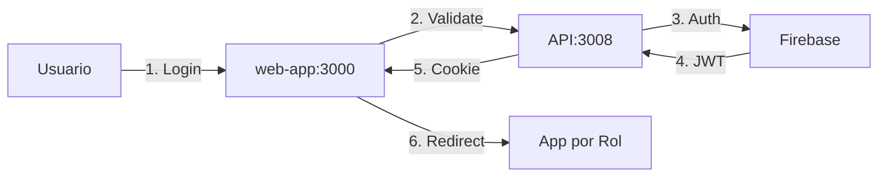

# 🔒 Auditoría de Seguridad SSO - Método Socrático
*Documento interactivo para evaluar la arquitectura de autenticación*

## 📋 Checklist de Verificación

### Sección 1: Arquitectura SSO
- [ ] ¿Cuál es el único punto de entrada configurado para autenticación?
- [ ] ¿La web-app gestiona tokens y cookies correctamente?
- [ ] ¿Firebase Auth está integrado y validando credenciales?

### Sección 2: Flujo de Autenticación

#### Pregunta Diagnóstica:
> **Si accedo directamente a `localhost:3003`, ¿qué sucede?**

Verificar:
```bash
# Test 1: Acceso directo sin autenticación
curl -I http://localhost:3003/dashboard

# Respuesta esperada: 
# 302 Redirect a /login
# Respuesta actual: ___________
```

#### Pregunta de Seguridad:
> **¿Cómo sabe el sistema quién soy sin pasar por el login central?**

Verificar en DevTools:
- [ ] ¿Hay cookies con nombre 'auth', 'token' o 'session'?
- [ ] ¿Son httpOnly? 
- [ ] ¿Tienen flag Secure?
- [ ] ¿Tienen SameSite configurado?

### Sección 3: Análisis de Riesgos

#### 🚨 Pregunta Crítica HIPAA:
> **¿Qué pasaría si un paciente A accede a los datos del paciente B?**

Escenarios a evaluar:
1. Sin autenticación, ¿puedo ver `/api/patients/123`?
2. Como paciente, ¿puedo ver `/api/patients/456`?
3. ¿Se registra quién accedió a qué datos?

**Costo potencial de violación:** $50,000 - $2,000,000 USD

### Sección 4: Estado de la Aplicación

#### Pregunta de Funcionalidad:
> **Sin token válido, ¿qué información tiene la aplicación?**

```javascript
// Verificar en consola del navegador:
console.log({
  userId: window.currentUser?.id,
  role: window.currentUser?.role,
  permissions: window.currentUser?.permissions
});

// Resultado esperado:
// { userId: "abc123", role: "DOCTOR", permissions: [...] }
// Resultado actual: ___________
```

### Sección 5: Flujo Ideal vs Realidad

#### Ejercicio de Mapeo:
> **Dibuja el flujo actual vs el flujo esperado**

**Flujo Esperado:**


**Flujo Actual:**
```
[Completar basado en pruebas]
```

### Sección 6: Plan de Acción

#### Pregunta de Implementación:
> **¿Qué necesitamos implementar primero?**

**Prioridad 1 - Crítico:**
- [ ] Login funcional en web-app
- [ ] Cookies httpOnly
- [ ] Middleware de autenticación

**Prioridad 2 - Importante:**
- [ ] Rate limiting
- [ ] Auditoría de accesos
- [ ] Refresh tokens

**Prioridad 3 - Mejoras:**
- [ ] 2FA
- [ ] Session management
- [ ] Logout sincronizado

## 🧪 Scripts de Verificación

### Test 1: Verificar Punto de Entrada
```javascript
// test-entry-point.js
async function testEntryPoint() {
  console.log("¿Cuál es el comportamiento al acceder sin auth?");
  
  const endpoints = [
    'http://localhost:3000',
    'http://localhost:3002/dashboard',
    'http://localhost:3003/patients'
  ];
  
  for (const url of endpoints) {
    const response = await fetch(url, { redirect: 'manual' });
    console.log(`${url}: ${response.status}`);
    
    // ¿Redirige a login? ¿O permite acceso?
  }
}
```

### Test 2: Verificar Cookies
```javascript
// test-cookies.js
function checkAuthCookies() {
  const cookies = document.cookie.split(';');
  
  console.log("¿Qué cookies de autenticación existen?");
  cookies.forEach(cookie => {
    if (cookie.includes('auth') || 
        cookie.includes('token') || 
        cookie.includes('session')) {
      console.log(`Found: ${cookie}`);
      
      // Pregunta: ¿Es accesible desde JavaScript?
      // Si sí = PROBLEMA (debería ser httpOnly)
    }
  });
}
```

### Test 3: Verificar Permisos
```javascript
// test-permissions.js
async function testUnauthorizedAccess() {
  console.log("¿Puedo acceder a datos sin autenticación?");
  
  const sensitiveEndpoints = [
    '/api/patients',
    '/api/medical-records',
    '/api/prescriptions'
  ];
  
  for (const endpoint of sensitiveEndpoints) {
    try {
      const response = await fetch(`http://localhost:3008${endpoint}`);
      console.log(`${endpoint}: ${response.status}`);
      
      // Pregunta: ¿Devuelve 401/403 o datos?
    } catch (error) {
      console.log(`${endpoint}: ${error.message}`);
    }
  }
}
```

## 📊 Matriz de Evaluación

| Componente | Pregunta Clave | Estado Actual | Estado Deseado | Riesgo |
|------------|---------------|---------------|----------------|--------|
| Entry Point | ¿Hay un único punto de entrada? | ❌ Múltiples | ✅ web-app:3000 | ALTO |
| Cookies | ¿Son httpOnly y Secure? | ❌ No existen | ✅ httpOnly + Secure | CRÍTICO |
| Tokens | ¿Se validan en cada request? | ❌ No | ✅ Middleware activo | CRÍTICO |
| Auditoría | ¿Se registra cada acceso? | ❌ No | ✅ Logs completos | LEGAL |
| Roles | ¿Se respetan los permisos? | ❓ Sin verificar | ✅ RBAC activo | ALTO |

## 🎯 Preguntas para el Equipo

### Para Desarrolladores:
1. ¿Por qué elegimos no usar localStorage para tokens?
2. ¿Cómo garantizamos que el token no se pueda robar con XSS?
3. ¿Qué pasa si el API server está caído?

### Para Arquitectos:
1. ¿Es escalable tener un único punto de entrada?
2. ¿Cómo manejamos sesiones concurrentes?
3. ¿Qué pasa con apps móviles en este flujo?

### Para Seguridad:
1. ¿Cumplimos con HIPAA y GDPR?
2. ¿Tenemos logs de auditoría suficientes?
3. ¿Cómo detectamos intentos de acceso no autorizado?

## 📚 Recursos de Aprendizaje

- [OWASP Authentication Cheatsheet](https://cheatsheetseries.owasp.org/cheatsheets/Authentication_Cheat_Sheet.html)
- [JWT Best Practices](https://tools.ietf.org/html/rfc8725)
- [HIPAA Security Rule](https://www.hhs.gov/hipaa/for-professionals/security/index.html)

## ✅ Conclusión de la Auditoría

**Fecha:** ___________  
**Auditor:** ___________

### Resumen Ejecutivo:
> _[Completar basado en las respuestas a las preguntas anteriores]_

### Recomendaciones Prioritarias:
1. ___________
2. ___________
3. ___________

### Próximos Pasos:
- [ ] Implementar cambios críticos
- [ ] Re-auditar en 30 días
- [ ] Capacitar al equipo

---

*Este documento utiliza el método socrático para guiar el descubrimiento de problemas de seguridad y sus soluciones. Las preguntas están diseñadas para provocar reflexión y comprensión profunda de la arquitectura.*