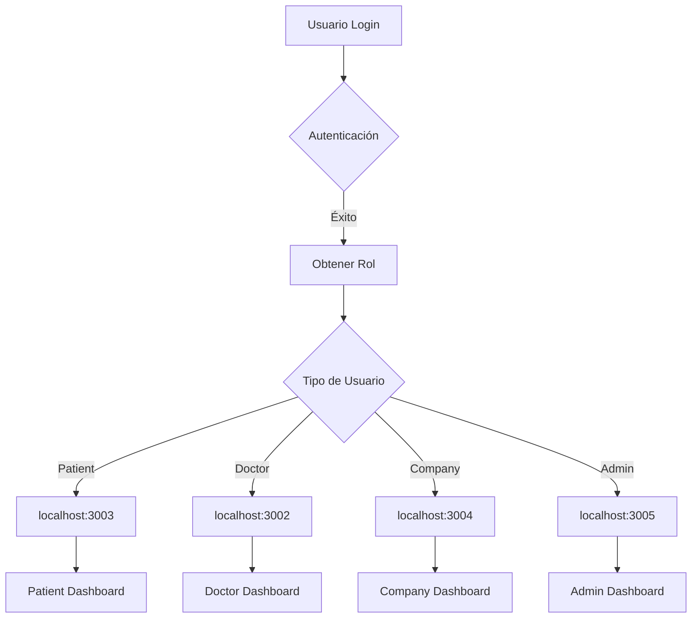

# 🔀 Análisis del Sistema de Redirección por Rol - AltaMedica

## 📊 Estado Actual

### 🔴 Problemas Identificados

1. **Mapeo de Puertos Incorrecto**
   - El archivo `app-urls.ts` tiene los puertos mal asignados
   - La página de login tiene URLs hardcodeadas con puertos incorrectos
   - Inconsistencia entre diferentes archivos

2. **Puertos Correctos vs Actuales**
   ```
   CORRECTO (según CLAUDE.md):        ACTUAL (en código):
   - patients: 3003                    - patients: 3004 ❌
   - doctors: 3002                     - doctors: 3003 ❌
   - companies: 3004                   - companies: 3002 ❌
   - admin: 3005                       - admin: 3005 ✅
   ```

3. **Redirección Hardcodeada**
   - Login page (`/src/app/(auth)/login/page.tsx`):
     ```typescript
     const dashboardUrl = userProfile.role === 'patient' ? '/dashboard' 
       : userProfile.role === 'doctor' ? 'http://localhost:3002/dashboard'
       : userProfile.role === 'company' ? 'http://localhost:3004/dashboard'
       : '/dashboard'
     ```
   - No usa el archivo de configuración centralizado
   - No considera el rol 'admin'

## 🛠️ Soluciones Propuestas

### 1. Corregir Configuración de URLs

```typescript
// src/config/app-urls.ts - CORREGIDO
const developmentUrls: AppUrls = {
  patients: 'http://localhost:3003',    // ✅ Corregido
  doctors: 'http://localhost:3002',     // ✅ Corregido
  companies: 'http://localhost:3004',   // ✅ Corregido
  admin: 'http://localhost:3005',       // ✅ Ya estaba correcto
  api: 'http://localhost:3001'          // ✅ Agregar API server
};
```

### 2. Implementar Servicio de Redirección Centralizado

```typescript
// src/services/redirect-service.ts
import { APP_URLS, getDashboardUrl } from '@/config/app-urls';

export class RedirectService {
  static redirectToRoleDashboard(role: string, router: any) {
    const dashboardUrl = getDashboardUrl(role as any);
    
    // Si es URL externa, usar window.location
    if (dashboardUrl.startsWith('http')) {
      window.location.href = dashboardUrl;
    } else {
      // Si es ruta interna, usar router
      router.push(dashboardUrl);
    }
  }
  
  static getPostLoginRedirect(role: string): string {
    // Verificar si hay una ruta guardada
    const savedRoute = sessionStorage.getItem('redirectAfterLogin');
    if (savedRoute) {
      sessionStorage.removeItem('redirectAfterLogin');
      return savedRoute;
    }
    
    // Si no, redirigir según el rol
    return getDashboardUrl(role as any);
  }
}
```

### 3. Actualizar AuthContext

```typescript
// En AuthContext.tsx - método signIn
const signIn = async (email: string, password: string) => {
  try {
    // ... código de autenticación ...
    
    // Redirección basada en rol
    const redirectUrl = RedirectService.getPostLoginRedirect(profile.role);
    
    if (redirectUrl.startsWith('http')) {
      window.location.href = redirectUrl;
    } else {
      router.push(redirectUrl);
    }
  } catch (err) {
    // ... manejo de errores ...
  }
};
```

### 4. Implementar Middleware de Redirección

```typescript
// src/middleware/role-redirect.ts
export function roleRedirectMiddleware(request: NextRequest) {
  const token = request.cookies.get('auth-token');
  
  if (!token) return null;
  
  const user = decodeToken(token);
  const currentPath = request.nextUrl.pathname;
  
  // Si el usuario está en web-app pero debería estar en su app específica
  if (currentPath.startsWith('/dashboard') && user.role !== 'patient') {
    const targetUrl = getDashboardUrl(user.role);
    return NextResponse.redirect(new URL(targetUrl));
  }
  
  return null;
}
```

## 🚀 Plan de Implementación

### Fase 1: Corrección Inmediata
1. ✅ Corregir puertos en `app-urls.ts`
2. ✅ Actualizar login page para usar configuración centralizada
3. ✅ Actualizar RegisterForm para usar configuración centralizada

### Fase 2: Mejoras de Arquitectura
1. ⬜ Implementar RedirectService
2. ⬜ Actualizar AuthContext para usar RedirectService
3. ⬜ Agregar tests unitarios para redirecciones

### Fase 3: Seguridad y UX
1. ⬜ Implementar token compartido entre apps (JWT)
2. ⬜ Agregar loading states durante redirección
3. ⬜ Implementar fallback para errores de redirección

## 📐 Arquitectura de Redirección Propuesta



## 🔒 Consideraciones de Seguridad

1. **Token Compartido**
   - Implementar JWT con dominio compartido
   - Cookie segura con httpOnly y sameSite
   - Refresh token para mantener sesión

2. **CORS Configuration**
   ```javascript
   // En cada aplicación
   const corsOptions = {
     origin: [
       'http://localhost:3000',
       'http://localhost:3002',
       'http://localhost:3003',
       'http://localhost:3004',
       'http://localhost:3005'
     ],
     credentials: true
   };
   ```

3. **Validación de Roles**
   - Verificar rol en el servidor antes de permitir acceso
   - No confiar solo en el token del cliente

## 📝 Ejemplo de Flujo Completo

```typescript
// 1. Usuario hace login en web-app (puerto 3000)
// 2. AuthContext valida credenciales
// 3. Obtiene perfil con rol = 'doctor'
// 4. RedirectService determina URL: http://localhost:3002/dashboard
// 5. Window.location.href ejecuta redirección
// 6. App de doctors valida token y muestra dashboard
```

## 🐛 Debugging

Para verificar el flujo de redirección:

```javascript
// Agregar en AuthContext
console.log('User role:', userProfile.role);
console.log('Redirect URL:', redirectUrl);
console.log('Is external:', redirectUrl.startsWith('http'));
```

## 📋 Checklist de Verificación

- [ ] Todos los puertos están correctamente mapeados
- [ ] Las redirecciones funcionan para todos los roles
- [ ] Los tokens se comparten entre aplicaciones
- [ ] Las rutas protegidas validan el rol correcto
- [ ] El botón "back" no rompe el flujo
- [ ] Las sesiones persisten entre apps

---
*Última actualización: Enero 2025*