# 🏥 **ALTAMEDICA PLATFORM - ARQUITECTURA VISUAL COMPLETA**

## 📋 **VISIÓN GENERAL DEL ECOSISTEMA**

AltaMedica Platform es una plataforma médica empresarial integral que combina telemedicina avanzada, diagnósticos impulsados por IA y cumplimiento estricto de HIPAA. La arquitectura está diseñada para manejar emergencias médicas con alta disponibilidad, seguridad PHI y escalabilidad empresarial.

---

## 🏗️ **1. ARQUITECTURA GENERAL DEL SISTEMA**

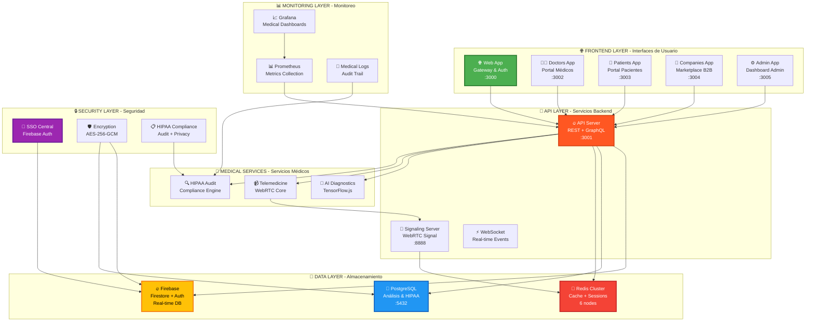

---

## 🌊 **2. FLUJO DE DATOS MÉDICOS Y AUTENTICACIÓN SSO**

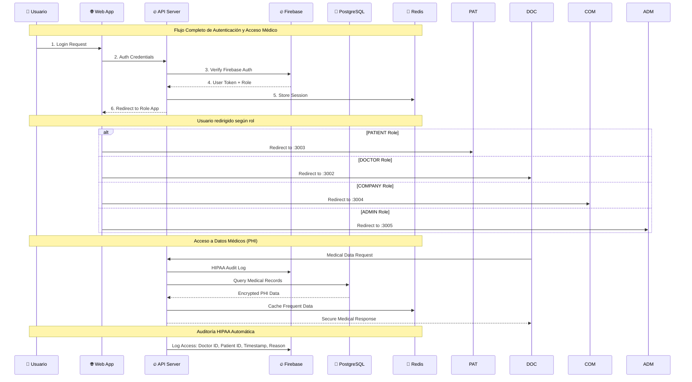

---

## 🏥 **3. ARQUITECTURA MÉDICA DETALLADA**

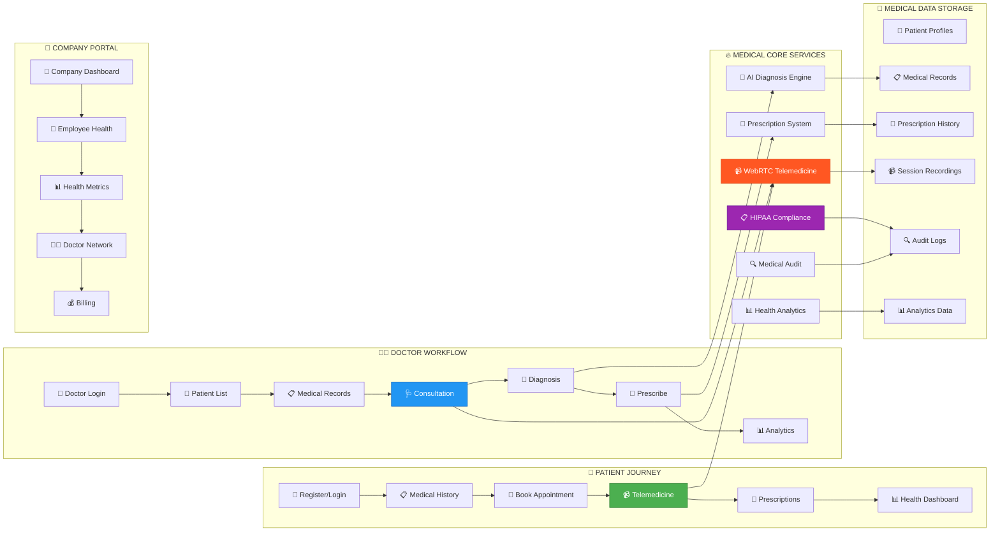

---

## 🔒 **4. SEGURIDAD Y CUMPLIMIENTO HIPAA**

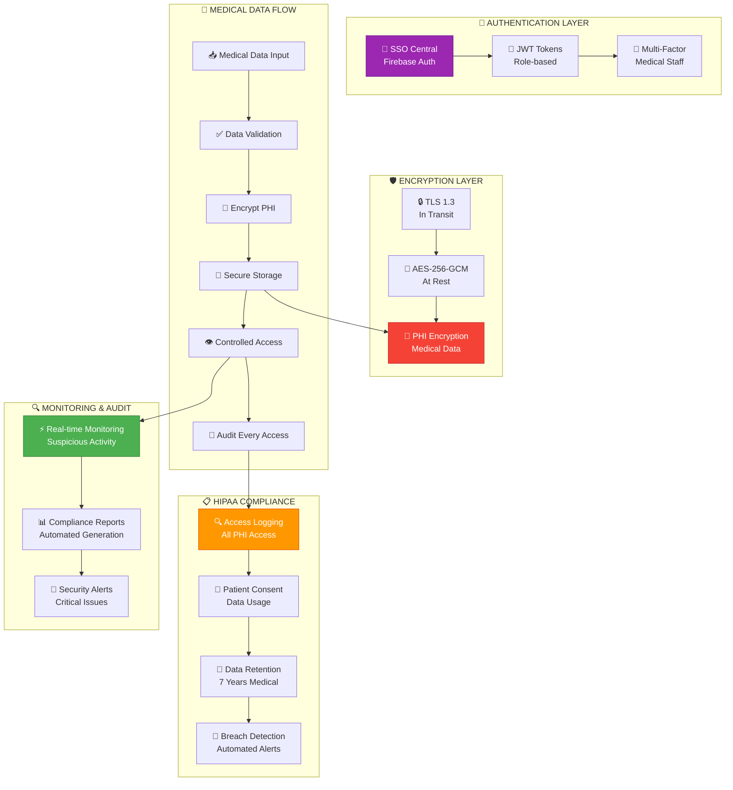

---

## 📡 **5. COMUNICACIÓN EN TIEMPO REAL Y TELEMEDICINA**

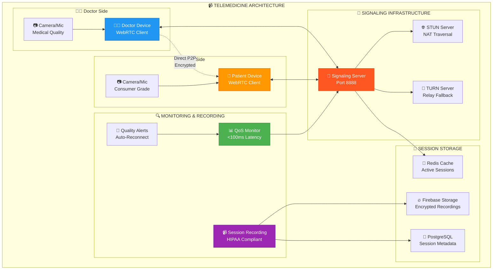

---

## 💾 **6. ARQUITECTURA DE DATOS HÍBRIDA**

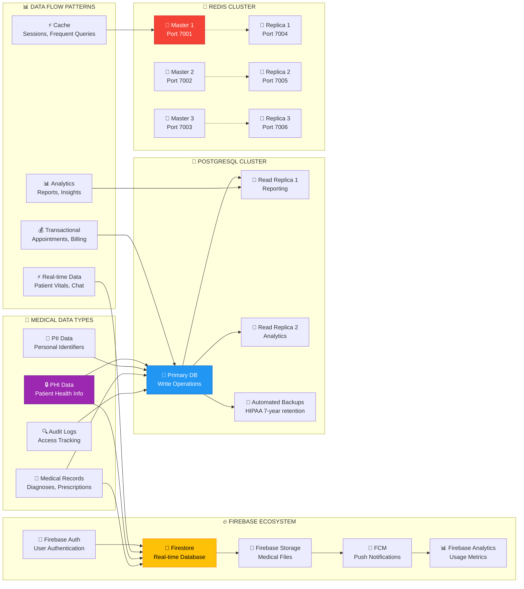

---

## 🔧 **7. DEVOPS Y INFRAESTRUCTURA**

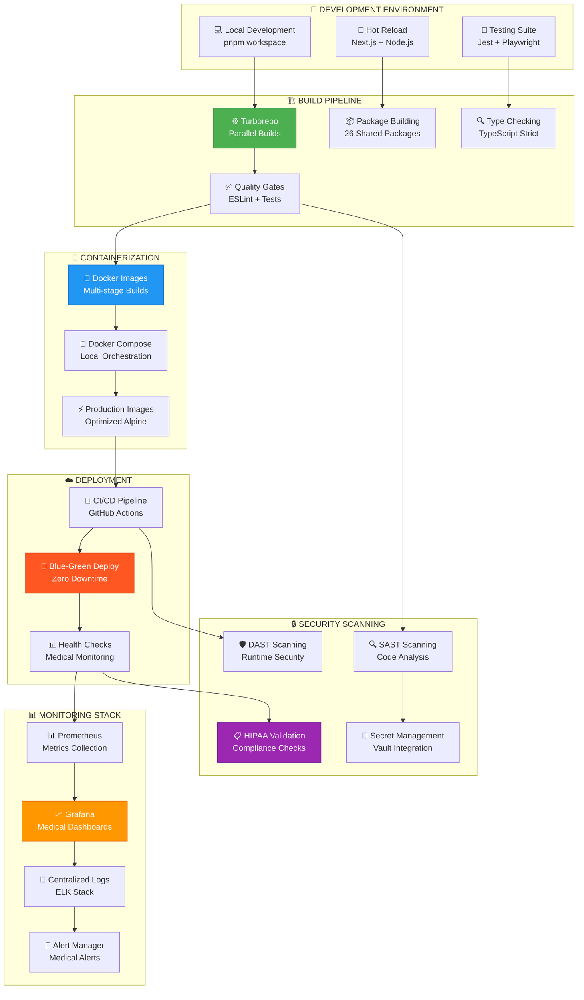

---

## 📊 **8. MONITOREO MÉDICO ESPECIALIZADO**

```mermaid
graph TD
    subgraph "🏥 MEDICAL METRICS DASHBOARD"
        subgraph "⚡ EMERGENCY METRICS"
            EM1[🚨 Response Time<br/>&lt; 3 seconds]
            EM2[👥 Patient Access<br/>&lt; 1 second]
            EM3[📹 WebRTC Latency<br/>&lt; 100ms]
            EM4[📱 System Uptime<br/>&gt; 99.9%]
        end

        subgraph "🏥 CLINICAL METRICS"
            CM1[👨‍⚕️ Active Consultations<br/>Real-time Count]
            CM2[📅 Appointments Today<br/>Scheduled vs Completed]
            CM3[💊 Prescriptions<br/>Issued per Hour]
            CM4[📋 Medical Records<br/>Access Frequency]
        end

        subgraph "🔒 HIPAA COMPLIANCE METRICS"
            HC1[🔍 Audit Logs<br/>100% Coverage]
            HC2[🔐 Data Encryption<br/>All PHI Encrypted]
            HC3[👤 Access Controls<br/>Role-based Success]
            HC4[💾 Backup Status<br/>7-year Retention]
        end

        subgraph "🚨 ALERT MANAGEMENT"
            AL1[🔴 Critical Alerts<br/>Immediate Response]
            AL2[🟡 Warning Alerts<br/>Monitor Closely]
            AL3[📧 Notification Channels<br/>Email, SMS, Webhook]
            AL4[📊 Alert History<br/>Pattern Analysis]
        end
    end

    subgraph "📈 PERFORMANCE MONITORING"
        PERF1[💾 Database Performance<br/>Query Response Times]
        PERF2[🔴 Cache Hit Ratios<br/>Redis Efficiency]
        PERF3[🖥️ Server Resources<br/>CPU, Memory, Disk]
        PERF4[🌐 Network Latency<br/>Inter-service Communication]
    end

    subgraph "👥 USER EXPERIENCE MONITORING"
        UX1[⏱️ Page Load Times<br/>Medical Apps]
        UX2[📱 Mobile Performance<br/>Patient/Doctor Apps]
        UX3[🔄 API Response Times<br/>Medical Endpoints]
        UX4[❌ Error Rates<br/>Failed Requests]
    end

    EM1 --> AL1
    EM2 --> AL1
    EM3 --> AL2
    EM4 --> AL1

    CM1 --> PERF1
    CM2 --> UX3
    CM3 --> PERF2
    CM4 --> HC1

    HC1 --> AL4
    HC2 --> AL1
    HC3 --> AL2
    HC4 --> AL1

    PERF1 --> UX3
    PERF2 --> UX1
    PERF3 --> AL2
    PERF4 --> UX3

    style EM1 fill:#F44336,stroke:#C62828,color:#fff
    style HC1 fill:#9C27B0,stroke:#6A1B9A,color:#fff
    style AL1 fill:#FF5722,stroke:#D84315,color:#fff
    style PERF1 fill:#4CAF50,stroke:#2E7D32,color:#fff
```

---

## 🔄 **9. BACKUP Y DISASTER RECOVERY**

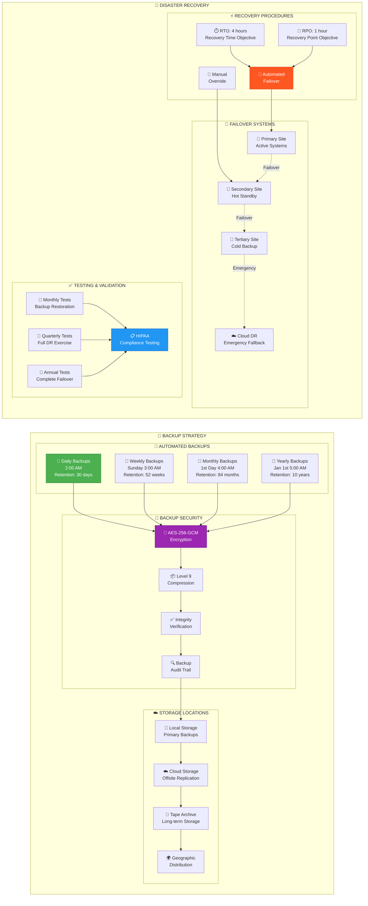

---

## 📱 **10. ARQUITECTURA DE APLICACIONES FRONTEND**

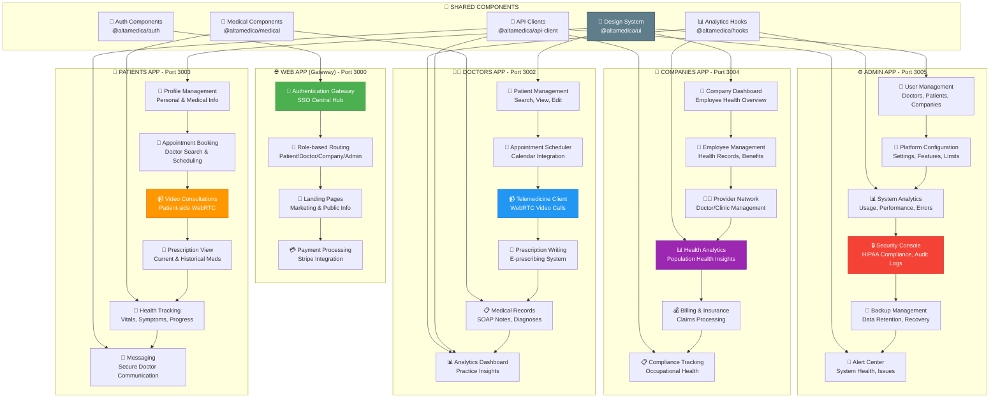

---

## 🚀 **11. PERFORMANCE & ESCALABILIDAD**

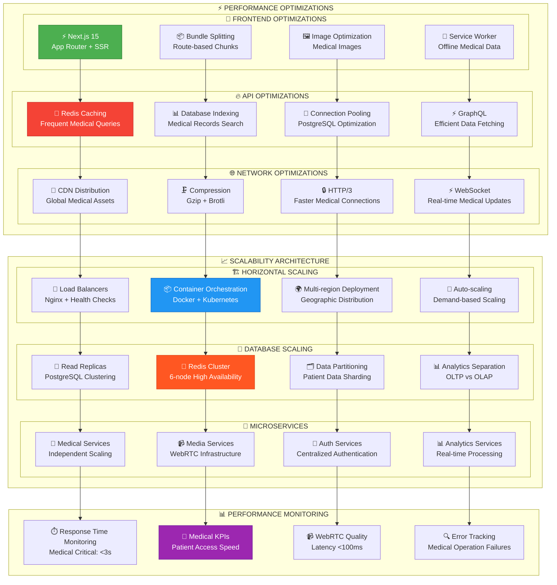

---

## 🔢 **12. MÉTRICAS Y ESTADÍSTICAS DE LA PLATAFORMA**

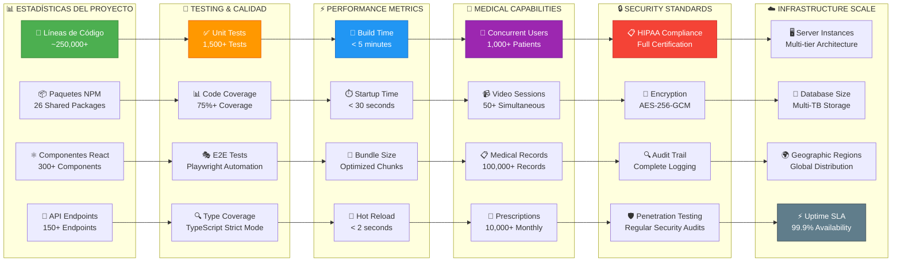

---

## 🎯 **CONCLUSIÓN DE LA ARQUITECTURA**

### **🏆 Fortalezas Clave de AltaMedica Platform**

1. **🏥 Especialización Médica**: Diseñada específicamente para cumplir con HIPAA y estándares médicos
2. **⚡ Alta Disponibilidad**: Arquitectura redundante para emergencias médicas 24/7
3. **🔒 Seguridad Robusta**: Encriptación end-to-end y auditoría completa de PHI
4. **📈 Escalabilidad Masiva**: Capaz de manejar miles de usuarios concurrentes
5. **🔄 Tiempo Real**: WebRTC optimizado para telemedicina de calidad médica
6. **🌍 Monorepo Modular**: 26 paquetes reutilizables para desarrollo acelerado
7. **📊 Monitoreo Especializado**: Métricas específicas para operaciones médicas

### **🚀 Capacidades Operacionales**

- **👥 Usuarios Concurrentes**: 1,000+ pacientes simultáneos
- **📹 Sesiones de Video**: 50+ consultas médicas paralelas
- **💾 Almacenamiento**: Multi-TB de registros médicos encriptados
- **⚡ Tiempo de Respuesta**: < 3 segundos para emergencias médicas
- **🔄 Disponibilidad**: 99.9% uptime con failover automático
- **📋 Cumplimiento**: 100% conforme con HIPAA y regulaciones médicas

### **🏗️ Arquitectura Técnica**

- **7 Aplicaciones Especializadas**: Cada una optimizada para su rol específico
- **3 Bases de Datos**: Firebase (tiempo real), PostgreSQL (analítica), Redis (cache)
- **26 Paquetes Compartidos**: Biblioteca de componentes médicos reutilizables
- **Sistema de Backup**: Retención de 7 años con encriptación AES-256-GCM
- **Monitoreo 24/7**: Alertas automáticas para problemas críticos médicos

**AltaMedica Platform representa una solución de telemedicina de grado empresarial, diseñada para hospitales, clínicas y organizaciones de salud que requieren la más alta calidad, seguridad y cumplimiento normativo.**

---

*Documentación generada automáticamente - AltaMedica Platform v2.0*  
*Última actualización: 8 de agosto de 2025*  
*Desarrollado por Eduardo Marques, MD - Especialista en Tecnología Médica*