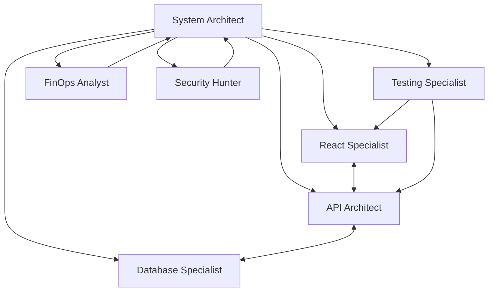

# 🏗️ Arquitectura del Project Manager de Altamedica con MCP Multi-Agente

## 📐 Visión General

El Project Manager (PM) de Altamedica es un sistema revolucionario que combina gestión de proyectos tradicional con inteligencia artificial multi-agente de última generación. Supera a sistemas como Cursor Composer y Windsurf Cascade mediante:

- **Colaboración Emergente**: Los agentes negocian y llegan a consensos autónomamente
- **Aprendizaje Continuo**: El sistema mejora con cada proyecto ejecutado
- **Principios Éticos**: Decisiones alineadas con valores médicos y de seguridad
- **Conocimiento en Tiempo Real**: Ingesta continua de vulnerabilidades, costos y tendencias

## 🧩 Componentes Principales

### 1. Frontend React (Project Manager UI)
```
altamedica-pm-system/
├── Dashboard Principal
│   ├── KPIs en Tiempo Real
│   ├── Proyectos Activos
│   ├── Recursos del Equipo
│   └── Panel Multi-Agente
├── Centro de Alertas
├── Protocolo de Crisis
└── Vista Detallada de Proyectos
```

### 2. Backend MCP (Multi-Agent Composer)
```
enhanced-multi-agent-mcp/
├── PhilosophicalCore (Ética)
├── KnowledgeIngestionEngine (Conocimiento)
├── LearningEngine (Aprendizaje)
├── CollaborationEngine (Colaboración)
└── SystemIntelligence (Análisis)
```

## 🤖 Arquitectura Multi-Agente

### Agentes Especializados



### Flujo de Trabajo Colaborativo

1. **Iniciación del Proyecto**
   ```
   PM → compose_application → System Architect
   ```

2. **Análisis y Planificación**
   ```
   System Architect → Análisis de Requerimientos
                   → Asignación de Agentes
                   → Definición de Arquitectura
   ```

3. **Negociación y Consenso**
   ```
   Agentes → Propuestas → Votación → Consenso/Escalamiento
   ```

4. **Ejecución y Monitoreo**
   ```
   Agentes → Tareas → Workspace Compartido → PM Dashboard
   ```

## 🧠 Sistema de Inteligencia

### 1. Aprendizaje Continuo
- **Patrones Arquitectónicos**: Identifica soluciones exitosas
- **Optimización de Agentes**: Mejora asignaciones basadas en rendimiento
- **Refinamiento de Templates**: Adapta plantillas según experiencia

### 2. Análisis Predictivo
- **Tasa de Éxito**: Predice probabilidad de completar el proyecto
- **Estimación de Tiempo**: Basada en proyectos similares anteriores
- **Identificación de Riesgos**: Detecta problemas potenciales temprano

### 3. Conocimiento en Tiempo Real
- **Vulnerabilidades**: Monitoreo continuo de CVEs
- **Costos Cloud**: Actualización de precios AWS/Azure/GCP
- **Tendencias Tecnológicas**: Análisis de popularidad y adopción

## 🛡️ Principios Éticos del Sistema

### Jerarquía de Decisiones
1. **Seguridad del Paciente** (Peso: 10/10)
   - Nunca comprometer datos médicos
   - Priorizar estabilidad sobre features
   
2. **Cumplimiento Regulatorio** (Peso: 9/10)
   - HIPAA, GDPR, HL7 siempre aplicados
   - Auditoría automática de decisiones

3. **Seguridad sobre Conveniencia** (Peso: 8/10)
   - MFA por defecto
   - Encriptación end-to-end

4. **Mantenibilidad** (Peso: 7/10)
   - Código limpio y documentado
   - Arquitectura modular

5. **Eficiencia de Costos** (Peso: 6/10)
   - Optimización de recursos cloud
   - ROI considerado en decisiones

## 📊 Flujo de Datos

```
┌─────────────────┐     ┌──────────────────┐     ┌─────────────────┐
│   PM Frontend   │────▶│   MCP Backend    │────▶│  Agentes IA     │
│   (React UI)    │◀────│  (Orchestrator)  │◀────│ (Specialists)   │
└─────────────────┘     └──────────────────┘     └─────────────────┘
         │                       │                         │
         ▼                       ▼                         ▼
┌─────────────────┐     ┌──────────────────┐     ┌─────────────────┐
│   Dashboards    │     │  Knowledge Base  │     │   Workspace     │
│   Alertas       │     │  Vulnerabilities │     │   Compartido    │
│   KPIs          │     │  Costs & Trends  │     │   Artefactos    │
└─────────────────┘     └──────────────────┘     └─────────────────┘
```

## 🔄 Ciclo de Vida del Proyecto

### 1. Definición (compose_application)
```javascript
{
  spec: {
    name: "Sistema HCE",
    features: ["historias clínicas", "telemedicina"],
    compliance: ["HIPAA", "HL7"]
  },
  context: {
    budget: 50000,
    teamSize: 5
  }
}
```

### 2. Análisis Multi-Dimensional
- **Técnico**: Arquitectura, tecnologías, complejidad
- **Ético**: Alineación con principios médicos
- **Económico**: Costos, ROI, optimizaciones
- **Riesgos**: Seguridad, vulnerabilidades, compliance

### 3. Colaboración Inteligente
- **Negociación**: Agentes proponen soluciones
- **Votación**: Consenso democrático
- **Resolución**: Moderador resuelve conflictos
- **Documentación**: Todas las decisiones registradas

### 4. Ejecución Adaptativa
- **Monitoreo Continuo**: KPIs en tiempo real
- **Ajustes Dinámicos**: Basados en feedback
- **Aprendizaje**: Experiencias alimentan el sistema
- **Mejora Continua**: Optimización constante

## 🚀 Ventajas Competitivas

### vs Cursor Composer
- ✅ **Colaboración Multi-Agente** vs generación simple
- ✅ **Aprendizaje Continuo** vs templates estáticos
- ✅ **Principios Éticos** vs solo funcionalidad
- ✅ **Conocimiento en Tiempo Real** vs datos estáticos

### vs Windsurf Cascade
- ✅ **Negociación Emergente** vs flujo lineal
- ✅ **Especialización de Agentes** vs modelo único
- ✅ **Workspace Compartido** vs silos de información
- ✅ **Análisis Predictivo** vs ejecución reactiva

## 🔐 Seguridad y Compliance

### Capas de Seguridad
1. **Infraestructura**: Encriptación, VPN, firewalls
2. **Aplicación**: Autenticación, autorización, auditoría
3. **Datos**: Encriptación en reposo y tránsito
4. **Procesos**: Protocolos de crisis, backups, DR

### Compliance Médico
- **HIPAA**: Privacidad de datos de pacientes
- **GDPR**: Protección de datos personales
- **HL7**: Interoperabilidad de sistemas médicos
- **FDA**: Regulaciones para software médico

## 📈 Métricas y KPIs

### Métricas de Proyecto
- Proyectos a Tiempo: 85%+
- Adherencia al Presupuesto: 92%+
- Calidad del Código: 94%+
- Satisfacción del Equipo: 88%+

### Métricas Médicas
- Seguridad del Paciente: 99.5%+
- Cumplimiento Regulatorio: 100%
- Tiempo de Respuesta: <100ms
- Disponibilidad: 99.9%+

## 🔮 Roadmap Futuro

### Q1 2025
- [ ] Integración con más sistemas médicos
- [ ] Agentes especializados en IoT médico
- [ ] Dashboard móvil para PM

### Q2 2025
- [ ] IA predictiva mejorada
- [ ] Integración con blockchain médico
- [ ] Agentes de ML para diagnóstico

### Q3 2025
- [ ] Expansión internacional
- [ ] Certificación ISO 13485
- [ ] Marketplace de agentes

## 🎯 Conclusión

El Project Manager de Altamedica con MCP Multi-Agente representa un salto cuántico en la gestión de proyectos médicos. La combinación de:

- **Inteligencia Artificial Colaborativa**
- **Principios Éticos Médicos**
- **Aprendizaje Continuo**
- **Conocimiento en Tiempo Real**

Lo convierte en la herramienta más avanzada del mercado para gestionar proyectos de salud digital, superando ampliamente a la competencia en capacidades, inteligencia y alineación con valores médicos.

---

*"El futuro de la gestión de proyectos médicos es inteligente, colaborativo y éticamente alineado"* - Altamedica PM System
